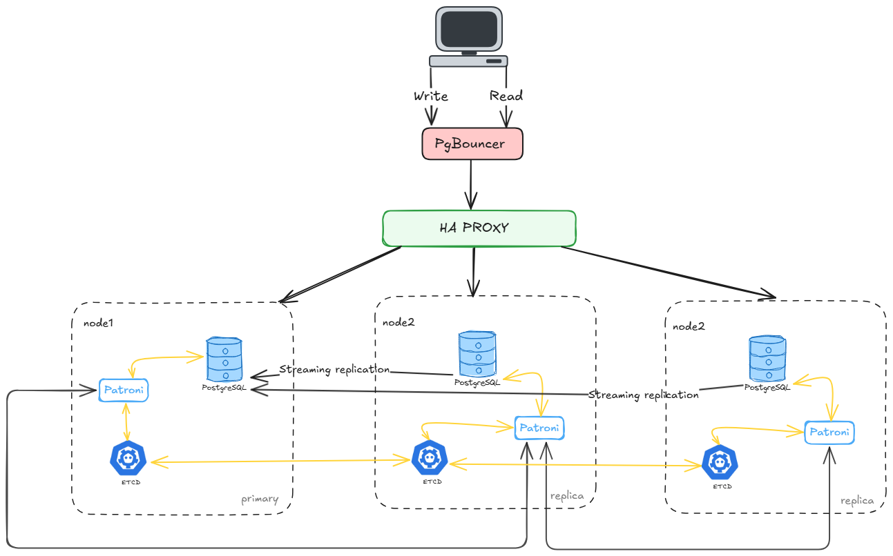
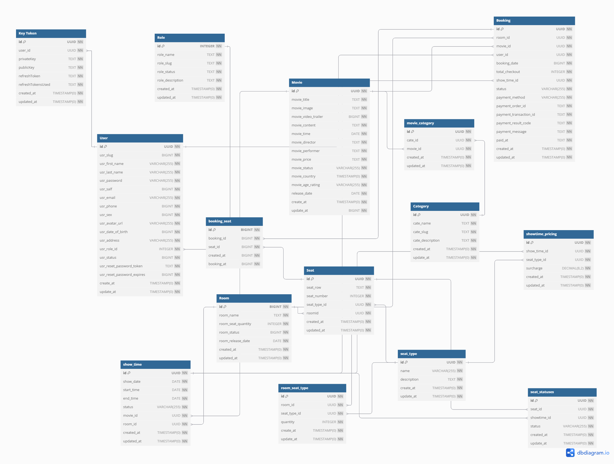
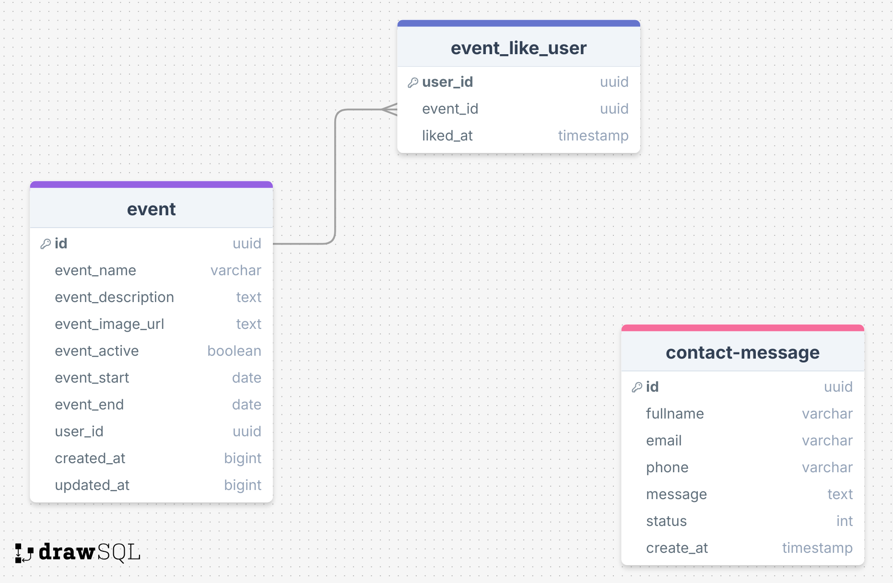

# FastTickets Hub - Kiến trúc hệ thống

## Tiếng Việt

### 1. Kiến trúc tổng quan

### 2. Kiến trúc Cloud

### 3. Cấu hình HAProxy

### 4. ERD core services

### 5. ERD intraction services

### 6. ERD marketing services

---

## Mô tả / Description

### Tiếng Việt
Bộ sưu tập sơ đồ kiến trúc này mô tả:
- **Kiến trúc tổng quan**: Cái nhìn toàn cảnh về hệ thống FastTickets
- **Cloud**: Cấu trúc triển khai trên nền tảng đám mây
- **HAProxy**: Cấu hình cân bằng tải và proxy ngược
- **ERD Dịch vụ cốt lõi**: Các thành phần chính của hệ thống
- **ERD Dịch vụ tương tác**: Kiến trúc tương tác với người dùng
- **ERD dịch dụ chiến lược người dùng**: Hệ thống quảng cáo và marketing

### English
This architecture diagram collection describes:
- **Overall Architecture**: Complete overview of FastTickets system
- **Cloud**: Cloud deployment structure
- **HAProxy v2**: Load balancer and reverse proxy configuration
- **ERD Core Services**: Main system components
- **ERD Interaction Services**: Interaction-service communication architecture
- **ERD Marketing Services**: Advertising and marketing system